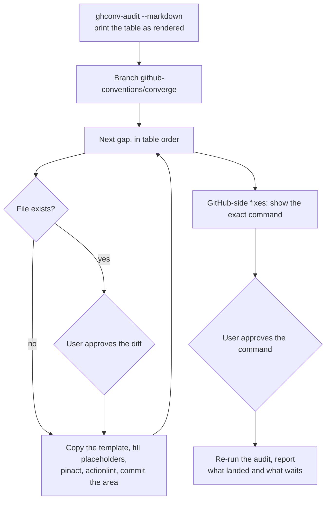
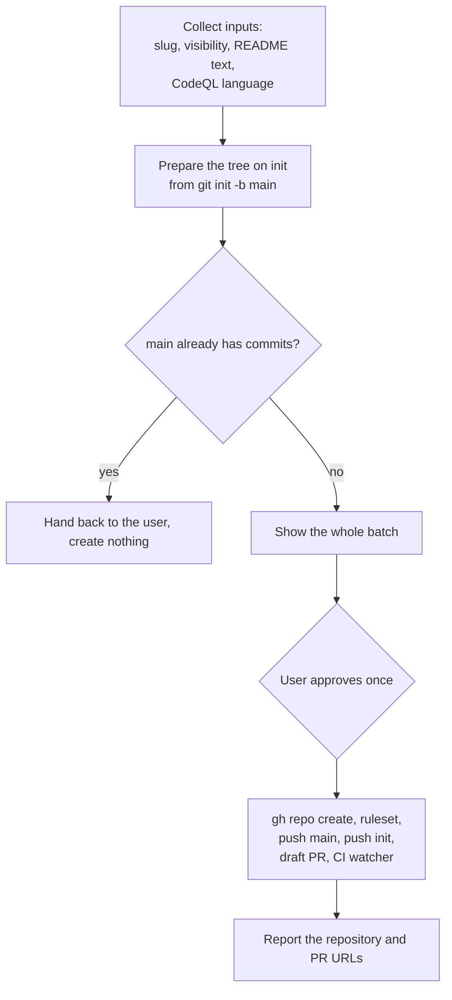
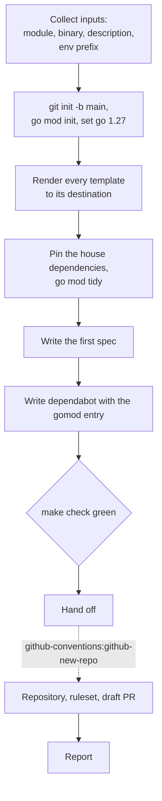
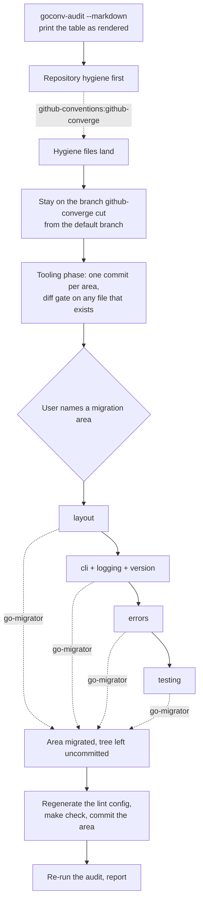
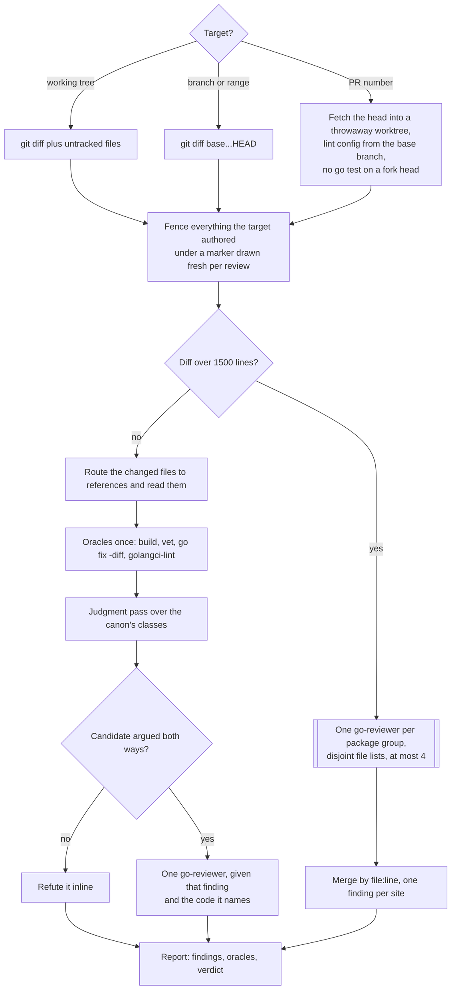
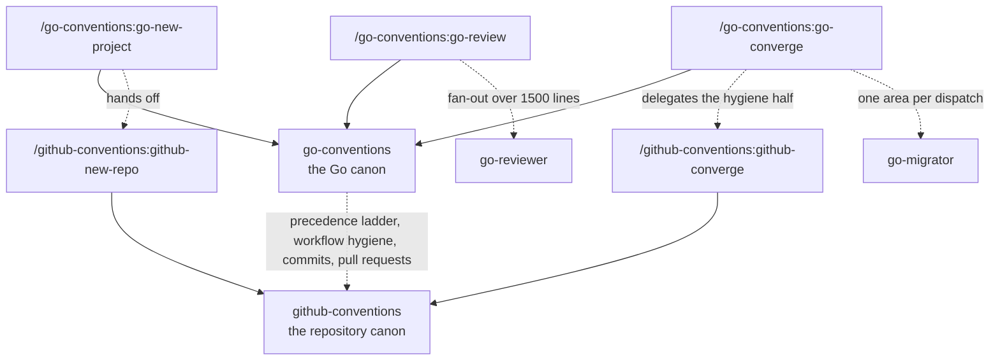

# conventions-claude

[](https://github.com/jhoblitt/conventions-claude/actions/workflows/validate.yml)
[](https://scorecard.dev/viewer/?uri=github.com/jhoblitt/conventions-claude)

A [Claude Code plugin marketplace](https://code.claude.com/docs/en/plugin-marketplaces)
with two plugins that stop convention drift: **go-conventions**, the house
canon for how Go code is written, tested, logged, linted, built, and
released, and **github-conventions**, the canon for how a GitHub repository
is created, kept hygienic, and worked on through commits and pull requests.
go-conventions depends on github-conventions; installing the first installs
both.

## Install

Inside Claude Code:

```text
/plugin marketplace add jhoblitt/conventions-claude
/plugin install go-conventions@conventions-claude
```

or from a shell:

```sh
claude plugin marketplace add jhoblitt/conventions-claude
claude plugin install go-conventions@conventions-claude
```

A repository with no Go in it installs `github-conventions@conventions-claude`
on its own.

To pick up updates later:

```sh
claude plugin marketplace update conventions-claude   # refresh the index
claude plugin update go-conventions@conventions-claude  # install the new version
```

or inside Claude Code:

```text
/plugin marketplace update conventions-claude
/plugin update go-conventions@conventions-claude
/reload-plugins
```

After the shell form, run `/reload-plugins` in running sessions — a
restart also works. The marketplace step alone only refreshes the
index; it does not update the installed plugin.

## What's inside

### github-conventions

| Skill | What it does |
| --- | --- |
| `github-conventions` | The canon. Loads when you create a repository, edit a workflow or `dependabot.yml`, commit, rebase, open or update a pull request, watch CI, or post a GitHub comment. Owns the precedence ladder both plugins share. |
| `/github-conventions:github-converge` | Audits an existing repository against the canon and applies the file half on a branch. |
| `/github-conventions:github-new-repo` | Creates a repository the house way: empty, ruleset-protected, populated by a draft pull request. |

### go-conventions

| Skill | What it does |
| --- | --- |
| `go-conventions` | The canon. Loads when you write or refactor Go, edit `go.mod`, a lint config, a Makefile, a goreleaser config or a Go workflow, or choose a Go library. |
| `/go-conventions:go-new-project` | Scaffolds a new module: cobra and viper, `log/slog`, Ginkgo, the house lint tier, goreleaser with ko, then hands off to `github-new-repo`. |
| `/go-conventions:go-converge` | Audits an existing Go repository, applies the tooling half, and migrates one named area at a time. |
| `/go-conventions:go-review` | Reviews a working tree, a branch, or a pull request against the review canon. |

Two hooks come with go-conventions: after a `.go` file is written or edited it
is formatted with gofumpt (or gofmt), and a session that starts in a Go module
is told the module path and to load the canon. Both cost nothing anywhere else
— the launcher checks the path and the presence of `go.mod` before it builds
anything, and fails open.

### Skill workflows

`github-converge`:



`github-new-repo`:



`go-new-project`:



`go-converge`:



`go-review`:



### How the skills fit together



## Example prompts

- "Write a Go CLI that reconciles two inventories" — the canon loads on its own.
- "/go-conventions:go-new-project" — scaffold a new module and its repository.
- "/go-conventions:go-converge" — see what an existing repository is missing, then migrate an area at a time.
- "/go-conventions:go-review 1234" — review a pull request against the review canon.
- "/github-conventions:github-converge" — pin the actions, add the security workflows, protect the default branch.

## Scope

The plugins report and propose; they do not act outside the working tree
without saying so first. Converge creates a file that is absent, and shows a
diff before touching one that exists. Anything that reaches GitHub — a
repository, a ruleset, a push, a pull request, a comment — happens only as a
command you have seen and approved. A review reports; it never edits.

## Development

Validate after changes:

```sh
claude plugin validate --strict .
```

Content changes land via PR. Commit messages follow
[Conventional Commits](https://www.conventionalcommits.org/) — commitlint
enforces this on every PR — and releasing is automated: on each merge to
`main`, [semantic-release](https://github.com/semantic-release/semantic-release)
derives the next version from the commit types in the changeset (`fix:`,
`docs:`, `refactor:`, `perf:` → patch; `feat:` → minor; a breaking change →
major; other types cut no release), writes it into both plugin manifests and
`CHANGELOG.md`, tags, and publishes a GitHub release. Never bump a plugin
version in a PR — the release commit owns that field.

## License

[Apache-2.0](LICENSE)
